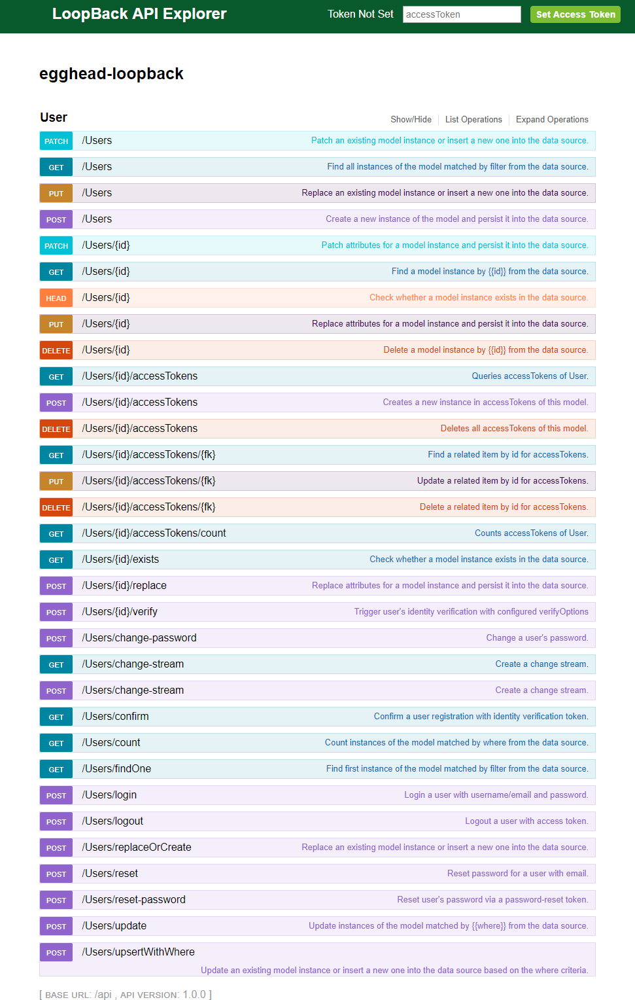

## Why we are interested

HeadForCode as a business is all about getting to know the tools and technologies available to us and creating useful applications for not just our business but yours and many others. We had looked at LoopBack in the past but at the time were quite happy working with other frameworks until recently, I gave it another go and can see the massive potential it has to become a core tool in our business.

Imagine that we were working on a project to show some form of dashboard for a data source of any kind, we would build some form of front-end consructed from a series of React components both third-party and our own. We would then need to build an API to integrate with the third-party database that starts off with no API of it's own, so we roll our own. 
## Benefits of LoopBack

The ability to build your own API quickly and your code is automatically generated along the way. You are given a choice of being able to store data in memory, in a file or you can of course hook up with external datasources of pretty much any kind.
## Building an API

``` bash
npm install -g loopback-cli
mkdir my-loopback
cd my-loopback
node .
```

View ```http://localhost:3000``` or ```http://localhost:3000/explorer```

