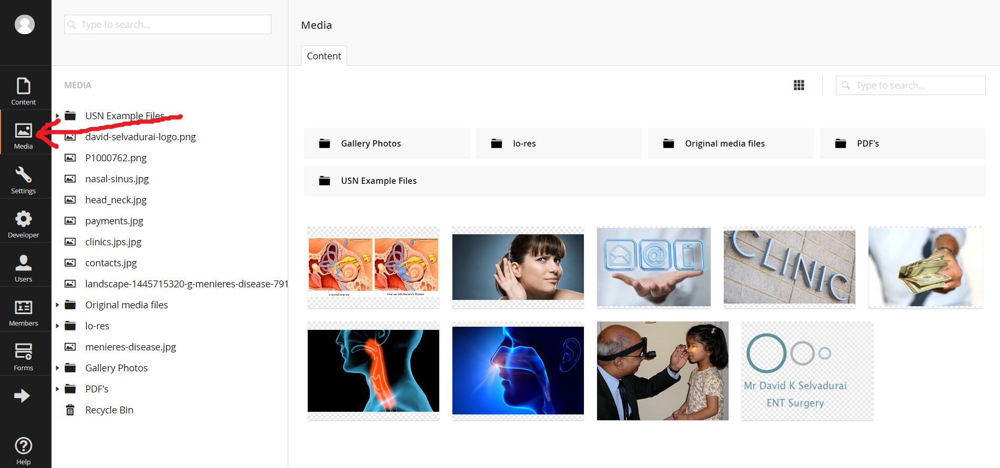
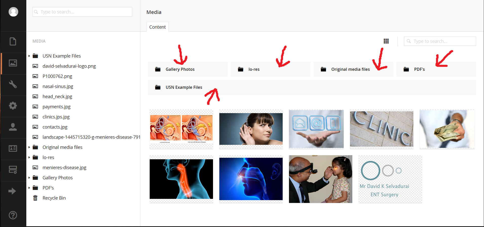
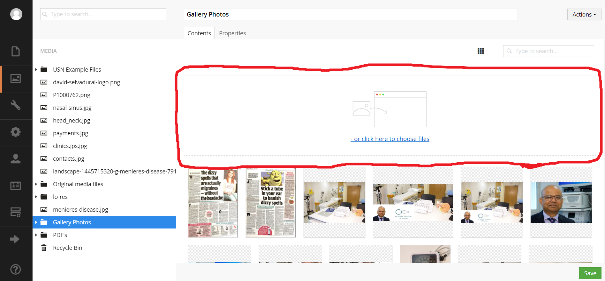
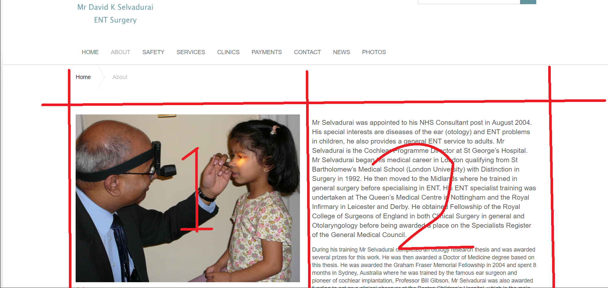

## Adding Media

Adding media is very simple. You need to navigate to the "Media" tab in the "section menu".

You need to select the right folder for the file you want to uploa.d, so if you have a PDF then select the "PDF" folder, if its a jpg, png, etc. then select the "picture" folder.

You will be displayed with a list of the media. 

The "Upload Box" can be clicked on to upload files from your computer or you can drag a drop files into it. 

When media is uploaded, it will display a uploading bar next then the file will appear below the upload box, this is how you know the file has uploaded successfully.
Make sure you save when everything is uploaded!

## Editing Media

First you need to make sure that your new files are in the media libary, when this is done you can move on to the next step. You need to find the place that you want to update your media (e.g. "homepage/photos/page components/photos/portrait1"),  then simply update it by deleting the old file (Look at Deleting Media) and then inserting the new file (Look at: Adding Media to your Content).
## Deleting Media

To delete media from the media libary, you need to go to the media libary, select the media that you wish to delete and a blue tick will appear at the top right of the files you select.  Then at the top of the page there is a "delete" button,  click that then click "okay" on the pop-up window and you will have successfully deleted the media.
## Adding Media to your Content

To add media to your content is ultimatly the next step that you will want to take. 
You can add media to your content in a few different ways
- one way is by using the "Media Picker" tool. To do this, navigate to the page that you would like to add media to: (e.g.homepage/services/general-ear-nose-&-throat).  click the "Media Picker" icon  select the file/files you want and make sure to submit and save.  
- You can also add it as a image on its own. For example if you had a grid on your page and it was two colunms wide like http://www.davidselvadurai.com/about/, then on the first colunm you could have a picture and then in the second one had text explaining the picture or writing something linked to the image.  To add an image in so we get the same result as this, we go to the place where we would like to add it in the back office (e.g. homepage/about/page-components/grid), then we can click on "Add Content", it will then display a menu, select the "image" option. 