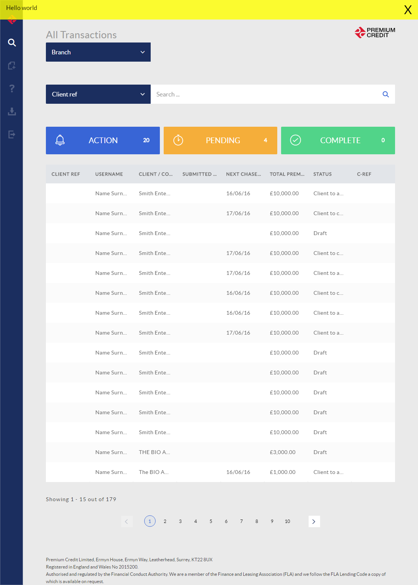

## Take a screenshot

- Open up the Chrome DevTools CTRL + SHIFT + I
- Then CTRL+SHIFT+P to open the DevTools Command Menu
- Type in "Screenshot" and you will see a list of possible commands, choose whichever one suits
- A screen-capture will be downloaded to your downloads folder!

The image captured can be the full length screen, including the bits that are not visible. We use this for building up documentation pages and tutorials here on this site. Very handy feature.