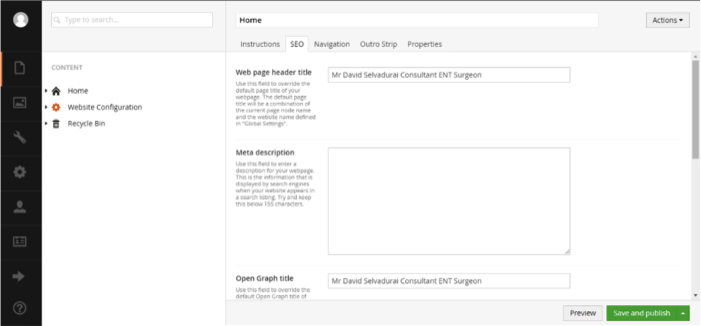
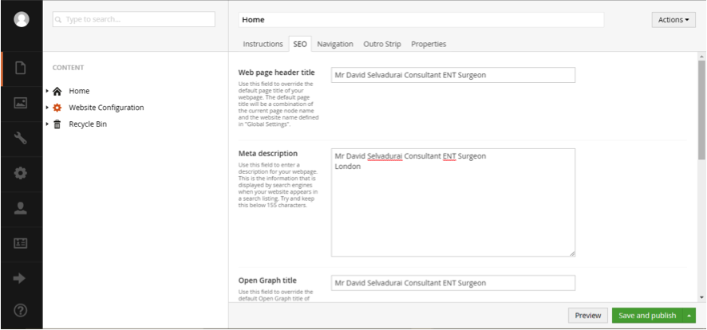

Meta Data is basically data that a browser such as Google, Firefox, Yahoo, etc. can read and then direct people to your site. For instance, if you wrote ‘London’ in your meta data and someone searched for ‘Ear Doctor in London’, because the word ‘London’ is there, it would display your website in the search results.

* Log in to the Backend of your site.
* Click on the page that you want to add the metadata to.
* Go to the Tab SEO

* You should see the heading that says Meta Description. This is where you will put all the words that are relevent to this page. So For example if you had the contact page selected, then you might want to write things such as: ‘Call’, ‘Phone number’, ‘email’ etc. 

