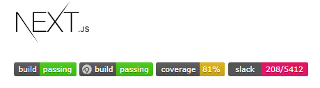

TODO - added repo to the frontmatter so that I can add it as a subscript title of an md.js generated page if it is present

NOTES - Love Next's tutorial app and the question block at the bottom, helps confirm that things are sinking in along the way, we should build something like that and it could be integrated into .md frontmatter

